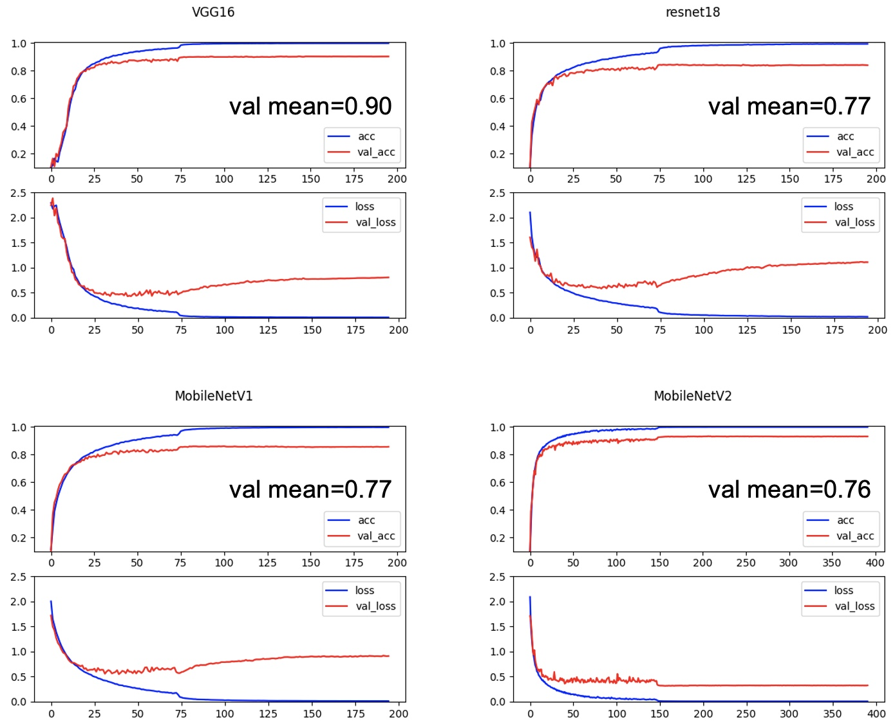
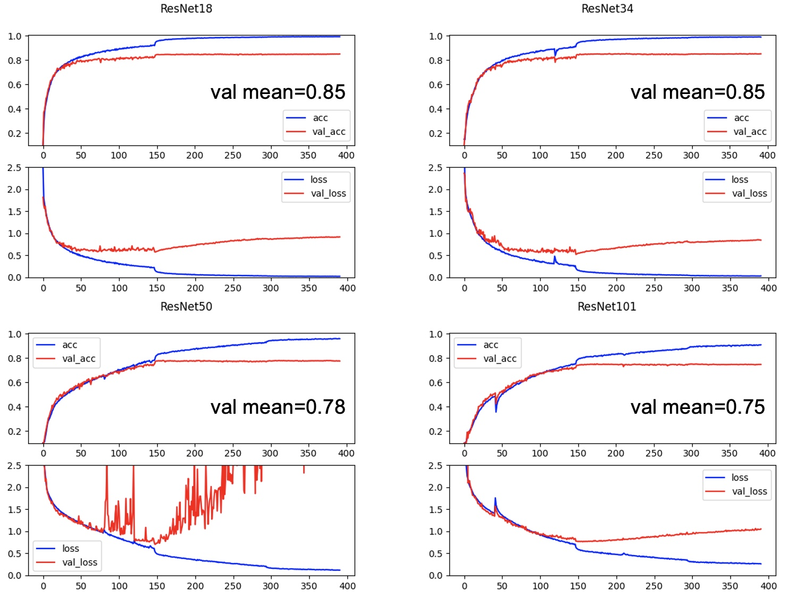
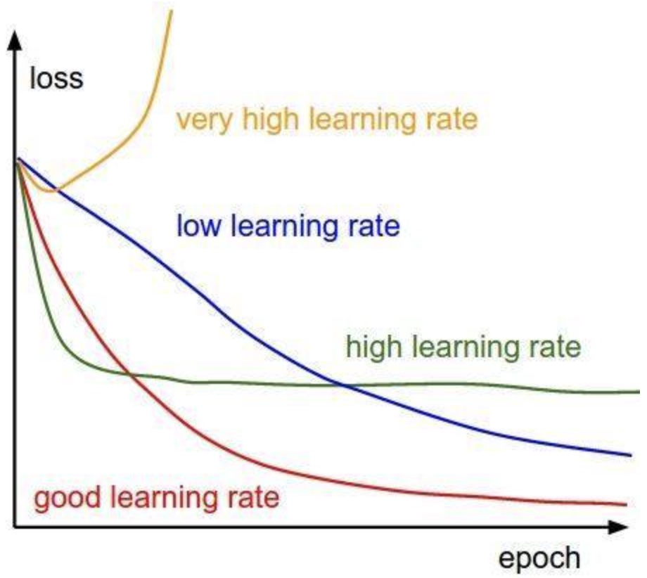
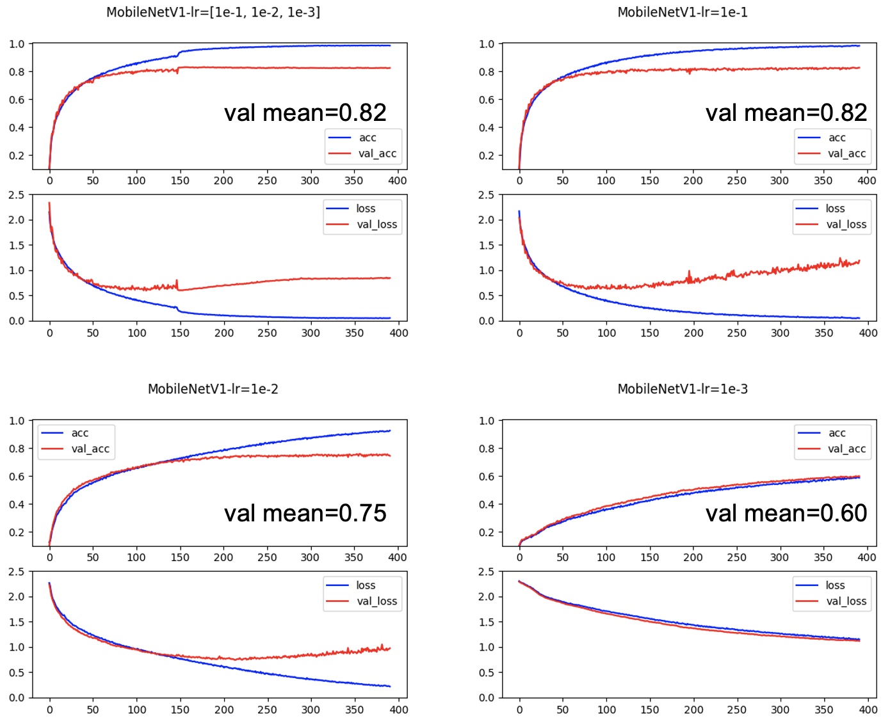
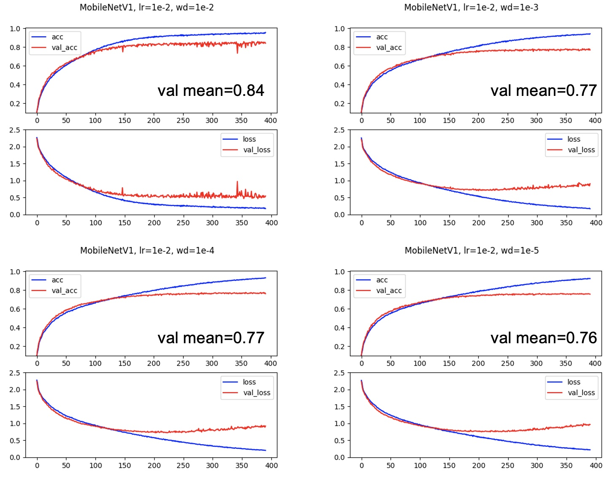

# Deep Learning Experiments on CIFAR-10

This repository shares various ablation experiments about how to tune a hyper-parameter and why it works. 

Table of Contents
=================
   * [Introduction](#introduction)
   * [Requirements](#requirements)
   * [Model](#model)
        * [Ex1: Architecture](#architecture)
        * [Ex2: Depth of Network](#depth-of-network)
   * [Ex3: Learning Rate](#learning-rate)
   * [Ex4: Weight Decay](#weight-decay)
   * [Reference](#reference)
   * [Summary](#summary)

## Introduction
Model ensembling is a simple and powerful way to achieve higher accuracy, which requires costly computation resources.

Here, we focus on improving the performance of single-model.
## Requirements
- pytorch
- matplotlib
- numpy

## Model

### Architecture
Four well-known models are chosen for comparison, as follows:
- VGG16: A typical CNN model for image classification
- ResNet18: A deeper CNN model using shortcut connections
- MobileNetV1: Nothing different to VGG16 except for using dw-conv and pw-conv
- MobileNetV2: An improvement model using linear bottleneck to fix the drawback of MobileNetV1

We use the same parameters (batch size may be changed because of limited CUDA memory) to train these models. The course of training is shown below:

In the training set, the final performance of each model is almost the same, which indicates that these models can perfectly fit the given dataset. 

The reasons for that can be concluded as follows:
1. CIFAR-10 is an easy task since there are just 32x32 pixels for each image and ten classes for the whole dataset.
2. These models are capable of image recognition after sufficient training, and that's why they have become popular and widely used.

Note that the accuracy on the test set of VGG16, ResNet18, MobileNetV1 and MobileNetV2 is about to 0.90, 0.85, 0.85 and 0.93, respectively.

Therefore, the ability of generalization of each model could be roughly sorted as MobileNetV2 > VGG16 > MobileNetV1 >= ResNet18.

MobileNetV2 achieves the best performance because of its elaborate architectures.

### Depth of Network
In this section, we train variants of ResNet to figure out whether deeper networks can work better.

A few years ago, training a deep network seems impossible as the problem of exploding gradient and vanishing gradient.

A network which has more than 100 layers can hardly converge until the proposal of residual networks that use shortcut connection to avoid exploding gradient and vanishing gradient.

The training results show that networks get worse performance while they become deeper.

Even using shortcut connection, the total loss of deeper networks decreases more slowly than that of shallower networks.

To summary, we can make networks as simple as possible, as long as it's capable to fit the given dataset.

## Learning Rate

Learning rate may be one of the most essential hyper-parameters for network training.

Here are some kinds of learning rates:
- very high learning rate: couldn't learn well
- low learning rate: too slow to converge
- high learning rate: oscillation near the local optimal

We design several experiments, and their results are shown below.

The results almost fit the previous hypothesis as expected, but one thing has beyond my expectation. 

Usually, we use strategies such as warm-up and learning rate decay to train networks efficiently.

However, this experiment shows that using the same learning rate can make the network smoothly get into the local optimal.

We will discuss this "weird" result in the final section.

## Weight Decay

Weight decay plays an important role in regularization, which ensures the generalization ability of models.

We set learning rate to 1e-2 in experiments of this part, and try different weight decay (1e-2, 1e-3, 1e-4, 1e-5).

1e-4, 1e-5, and 0 are considered as good values of weight decay.

Nonetheless, the model using 1e-2 weight decay achieves the best accuracy on both the training set and test set.

# Summary

After getting familiar with network training, we have mastered various training tricks.

In my opinion, choosing hyper-parameter is extremely dataset-dependent and experience-dependent.

For a new dataset, we can design and train networks using our experience first.

Subsequently, we tune parameters according to previous training and the characteristic of the dataset.

## Reference
https://github.com/tinyalpha/mobileNet-v2_cifar10
https://github.com/Z0m6ie/CIFAR-10_PyTorch